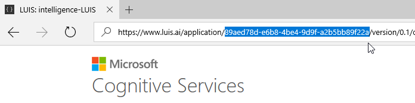

# QtLuis

Qt library to interact with Microsoft LUIS: Language Understanding Intelligent Service

Provides the ability to use the library with your existing projects (C++). 

See the [change log](CHANGELOG.md) for changes and road map.

### Language Understanding Intelligent Service (LUIS)

LUIS lets your app understand language

- LUIS is in beta and free to use
- Supported browsers: Internet Explorer 10/11, Chrome
 
In LUIS you can:

- Create language understanding models.
- Use pre-built, world-class models from Bing and Cortana.
- Deploy your models to an HTTP endpoint.
- Activate models on any device.

#### Where to find the Application ID and Subscription Key

You'll need these two values to configure the LuisDialog through the LuisModel attribute:

1. Application ID

    In the LUIS application's dashboard, you can copy the App ID from the address bar.
    
    
    
2. Subscription Key

    In the [My keys page](https://www.luis.ai/home/keys), copy the Programmatic API Key.
    
    

### How it works

...

## Contribute
Check out the [contribution guidelines](CONTRIBUTING.md)
if you want to contribute to this project.

## License
[Apache 2.0](LICENSE)
